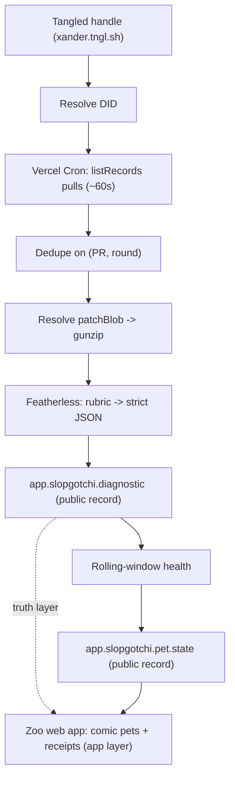

# Slopgotchi — Requirements

## Summary

Slopgotchi is a team "zoo" web app where each member has a tamagotchi-style pet whose health is a live, public signal of how much AI slop they ship to Tangled. You connect a Tangled handle; the system backfills and scores every pull request through an open model on Featherless against a slop rubric, then keeps watching for new PRs. Each result is written as a public ATProto record (the portable, tamper-proof truth); the zoo page renders every member's pet in a Club Penguin / early-Pokémon comic style, with health computed as a rolling average of recent slop.

## Problem Frame

AI-generated contributions are flooding open codebases with output that looks plausible but was never thought through: overbuilt abstractions, dependency bloat, weak or mock-only tests, and changes far broader than the task. The cost lands on reviewers and maintainers, and it is diffuse — no single PR feels worth blocking, so slop accumulates quietly.

Existing code-quality tools are private dashboards or per-PR reviewers: the signal dies inside one app, attached to no durable identity, invisible as social pressure. On Tangled — where contribution activity already lives as public protocol data tied to a developer's identity — there is room for an accountability signal that is itself public, portable, and identity-level, rather than another app-local score. The point is not to detect that AI was used; it is to make careless, unreviewed output visible at the identity level so people think before they push.

---

## Key Decisions

- **Split architecture: protocol carries the truth, the app carries the experience.** Slop scores, health, and diagnostic receipts are public ATProto records — portable, tamper-proof, renderable by any client. The team zoo workspace, comic-style rendering, and cosmetics are the app layer on top. This keeps the protocol-native differentiator intact while leaving room for a conventional product and revenue model.

- **Service-hosted records (labeler pattern), not writes into each user's repo.** ATProto records can only be written to a repo whose keys you hold, so Slopgotchi cannot drop a pet into someone else's identity. Instead it runs its own service DID and emits records that reference the target developer's DID as subject — conceptually an ATProto *labeler*. This lets it track any participating identity, makes receipts tamper-proof (the subject can't delete them), and is more honest than claiming the record lives "in" the developer's repo. The full `com.atproto.label` subscription protocol is not required; custom-lexicon records in the service repo, read via `listRecords`, are sufficient.

- **Team-scoped and opt-in.** Pets exist within a team workspace whose members have joined. This solves consent (you're in the zoo because you joined) and fits the workspace + monetization model, rather than unilaterally labeling all of Tangled.

- **Health is a rolling slop average derived from the receipts, not a cumulative counter.** A purely subtractive model decays every pet to zero and turns "everyone's sick" into noise. Health is recomputed as `100 − weighted average slop of recent PRs`, so it always reflects current behavior, self-corrects as clean work ships, and can't be gamed by idle time. Because it is derived from the public diagnostic records, any other client computes the same health from the same evidence.

- **The diff is on-protocol — the whole pipeline is protocol-native.** Verified: a `sh.tangled.repo.pull` record carries the patch inline as a `patchBlob` (gzipped git-format-patch) on each revision round. Scoring never requires touching git, SSH, or a knot — fetch the record, resolve the blob, gunzip, feed to the model.

- **Hosting is Vercel-only; "keeps watching" is a cron poll, not a websocket.** Vercel's serverless functions are request-scoped and cannot hold a persistent Jetstream websocket. So watching is a Vercel Cron job (~every 60s) that calls `listRecords` for each connected DID and scores any unseen `(PR, round)`. This collapses backfill and live-watch into one idempotent polling loop, keeps the "connect once, it keeps watching" demo (with ~1-minute lag, invisible on stage), and needs zero infrastructure beyond Vercel. True real-time Jetstream is a post-hackathon upgrade. Webhooks are the wrong tool regardless (push-only today, per-repo configured, no PR events).

- **Default health window: N = 10 recent PRs, recency-weighted (exponential decay).** Newer PRs dominate the average so the pet feels responsive to current behavior and the revision-recovery moment lands hard; older PRs fade and drop out at N = 10. Both N and the decay are tunable.

- **Diagnostics are idempotent per `(PR, round)`.** Tangled PRs have an append-only `rounds` array; backfill and the live listener can both observe the same record. Keying each diagnostic on the pull AT-URI plus round prevents double-scoring, and naturally supports re-scoring when a developer pushes a revision.

- **Monetization is pitch-only for V1.** Skins, looks, and backgrounds are the business-model story, not the hackathon build. Cosmetics are inherently app-local, so they don't touch the protocol layer.

---

## Actors

- A1. **Developer** — a Tangled identity (handle/DID) whose PRs are analyzed and who has a pet in a team zoo.
- A2. **Team owner** — creates a zoo workspace and adds member handles.
- A3. **Slopgotchi service** — holds the service DID; runs the analyzer, writes diagnostic and pet-state records, hosts the zoo web app.
- A4. **Featherless model** — open-weight model called over the OpenAI-compatible API to produce the structured slop score.
- A5. **Viewer** — anyone viewing a zoo or reading the public records (including third-party ATProto clients).

---

## Requirements

**Identity & onboarding**

- R1. A developer joins a team's zoo themselves (their own opt-in); receipts are only ever written about developers who have joined. A team owner cannot add an arbitrary non-member handle.
- R2. On join, the developer's handle resolves to a DID via standard ATProto handle resolution; no write access to the developer's repo is required.
- R3. On join, the system backfills by enumerating the developer's `sh.tangled.repo.pull` records (via `listRecords`) and scoring each, populating the zoo without further input.

**Slop analysis pipeline**

- R4. For each analyzed PR round, the system resolves the inline `patchBlob`, decompresses it to git-format-patch text, and submits it to Featherless with the rubric prompt.
- R5. The model returns strict JSON: a 0–100 slop score, per-category sub-scores (scope discipline, specificity/intent, dependency restraint, test thoughtfulness, maintainability), a verdict band, human-readable reasons, suggested "medicine," and a confidence level.
- R6. A Vercel Cron job polls connected identities (~every 60s), re-running `listRecords` and scoring any newly committed pull records and new rounds. Backfill and ongoing watch are the same polling loop.
- R7. Each diagnostic is idempotent on `(pull AT-URI, round)`; a round seen across multiple polls produces exactly one diagnostic.

**Protocol records (the truth layer)**

- R8. Each analyzed round produces a public `app.slopgotchi.diagnostic` record in the service repo, referencing the PR (subject AT-URI) and the developer (DID), carrying the score, category breakdown, verdict, reasons, model, and ruleset version.
- R9. Each developer has a public `app.slopgotchi.pet.state` record carrying current health, condition, the pointer to the latest diagnostic, and an updated timestamp — a cached projection recomputable from the diagnostics.
- R10. Records are world-readable and self-describing enough that a third-party client can render a pet and its receipts without Slopgotchi's app.

**Health model**

- R11. Health is computed as `100 − weighted average slop` over a developer's most recent N PRs, clamped to 0–100. Default: N = 10, recency-weighted by exponential decay (newer PRs dominate); both tunable.
- R12. A developer with no analyzed PRs has health 100 and a "no diagnoses yet" state.
- R13. Health updates whenever a new diagnostic lands, including re-scores from new rounds, so clean revisions visibly restore health.

**Zoo experience (the app layer)**

- R14. Each team has a zoo page rendering one pet per member, with the owner's handle shown above each pet, in a 2D comic-style aesthetic.
- R15. A pet's appearance/mood reflects its health band (e.g. sharp / mild / sick).
- R16. Selecting a pet opens its accountability view: current health, recent PRs with their scores and deltas, and for the latest sickness, the reasons and suggested medicine drawn from the diagnostic.

---

## Key Flows

- F1. Join & backfill
  - **Trigger:** A1 joins a zoo with their own handle.
  - **Actors:** A1, A3, A4
  - **Steps:** Resolve handle → DID; `listRecords` the developer's pulls; for each round, resolve `patchBlob` → gunzip → score via A4; write `app.slopgotchi.diagnostic` records; compute and write `app.slopgotchi.pet.state`.
  - **Outcome:** The member's pet appears in the zoo at its computed health.
  - **Covered by:** R1, R2, R3, R4, R5, R8, R9, R11

- F2. Ongoing watch (cron poll)
  - **Trigger:** Vercel Cron fires (~every 60s).
  - **Actors:** A3, A4
  - **Steps:** For each connected DID, `listRecords`; dedupe on `(PR, round)`; for any unseen round, resolve patch → score → write diagnostic → recompute health → update pet state.
  - **Outcome:** The member's pet reacts within ~a minute of a new PR or round.
  - **Covered by:** R6, R7, R8, R9, R13

- F3. Inspect a pet
  - **Trigger:** A5 selects a pet in the zoo.
  - **Actors:** A5
  - **Steps:** Read the developer's pet state and recent diagnostics; render health, PR history, reasons, and medicine.
  - **Outcome:** The viewer sees *why* the pet is the state it is in.
  - **Covered by:** R10, R16

- F4. Revision recovery
  - **Trigger:** A developer pushes a new round addressing a sloppy PR.
  - **Actors:** A1, A3, A4
  - **Steps:** New round scored as its own diagnostic; rolling-window health recomputed.
  - **Outcome:** The pet visibly recovers, rewarding the fix.
  - **Covered by:** R7, R13

---

## Visualization

---

## Acceptance Examples

- AE1. New member, no PRs
  - **Covers R12.**
  - **Given** a handle with no `sh.tangled.repo.pull` records, **when** added to a zoo, **then** the pet renders at health 100 with a "no diagnoses yet" state.

- AE2. Clean streak recovers health
  - **Covers R11, R13.**
  - **Given** a member whose recent PRs scored high slop, **when** subsequent PRs score clean, **then** rolling-window health climbs back as the old PRs fall out of the window.

- AE3. Revision re-scores
  - **Covers R7, R13.**
  - **Given** a sloppy PR already scored, **when** the developer appends a new round, **then** a new diagnostic is written for that round and health recomputes — without duplicating the prior round's diagnostic.

- AE4. Backfill/live dedupe
  - **Covers R7.**
  - **Given** a PR observed during backfill, **when** the same round later arrives via Jetstream, **then** no second diagnostic is created.

---

## Success Criteria

- A judge can watch a real Tangled handle get connected and see the zoo populate with scored pets end-to-end, live.
- Clicking any sick pet shows a concrete, defensible receipt (rubric reasons + medicine) — the score never reads as arbitrary.
- The diagnostic and pet-state records are inspectable as public ATProto data outside the app, demonstrating portability.
- The pipeline runs without any git/SSH access to knots — diff in, score out, entirely on-protocol.
- The whole system deploys on Vercel alone — web app plus the cron polling loop, no separate always-on service.

---

## Scope Boundaries

**Deferred for later**

- Skins, looks, backgrounds, and the payments system behind them (business-model pitch only for V1).
- Native desktop tamagotchi client.
- Auto-discovery / analysis of identities that haven't been added to a zoo.
- Repo-level pets and teammate interactions.
- Weighting by PR status (open / closed / merged) via `sh.tangled.repo.pull.status`.
- A Spindle/CI "slop check" surface (`.tangled/workflows`) as an alternative per-repo trigger.
- Fetching repo style context (raw files / archive) as additional model input.

**Outside this product's identity**

- Detecting *whether AI was used*. Slopgotchi scores carelessness, overbuild, weak tests, and dependency bloat — not authorship, which a diff cannot prove.
- Becoming a general-purpose AI code reviewer or merge gate. The output is an accountability signal, not a verdict that blocks contributions.
- Private, app-local scores. If the score isn't a public protocol record, the core differentiator is gone.

---

## Dependencies / Assumptions

- **Featherless** OpenAI-compatible endpoint with a suitable open-weight model; structured-JSON output enforced via the prompt; a `confidence` field surfaced because the model will sometimes be wrong.
- **ATProto primitives:** handle→DID resolution, `com.atproto.repo.listRecords`, and `com.atproto.sync.getBlob`. No persistent firehose connection in V1 — watching is `listRecords` polling on a schedule.
- **Vercel** hosts both the web app and the Cron polling loop; a persistent state store (seen `(PR, round)` set, connected DIDs, cached pet state) is needed since serverless functions don't retain memory between invocations.
- **A service DID / account** with a PDS the service can write the `app.slopgotchi.*` records to.
- **Verified, day-one facts:** PR diffs are inline `patchBlob` (gzipped git-format-patch) on `sh.tangled.repo.pull`; `target` = `{repo: DID, branch}` (required), `source` = `{branch, repo?}`; public repos are readable over unauthenticated HTTPS (only optional repo-context fetches need this, not the core pipeline).
- New `app.slopgotchi.*` lexicons must be defined; they do not exist yet.

---

## Outstanding Questions

**Deferred to planning**

- Featherless model choice and scoring determinism (temperature, retries) for stable public scores.
- Exact `app.slopgotchi.diagnostic` and `app.slopgotchi.pet.state` lexicon field shapes (note: per-round diagnostics; pet-state is a derived cache).
- Persistent store choice on Vercel for the seen-`(PR, round)` set, connected DIDs, and cached pet state.
- Cron cadence and per-invocation work budget (how many DIDs × PRs can be scored inside one function timeout).

---

## Sources / Research

- `sh.tangled.repo.pull` lexicon — inline `patchBlob` (gzipped git-format-patch) per append-only round; `target{repo:DID, branch}`, `source{branch, repo?}`, `rounds[]`. Related: `sh.tangled.repo.pull.comment`, `sh.tangled.repo.pull.status` (open/closed/merged). Verified from the Tangled `core` lexicons (`lexicons/pulls/`, `lexicons/repo/`).
- `sh.tangled.repo` lexicon — `knot` (host string), `repoDid`, `spindle`; clone URL is `https://<knot-or-appview>/<did-or-handle>/<repo>`.
- Tangled read access — public repos clone over unauthenticated HTTPS (appview 307-redirects to the knot's git-smart-HTTP); appview also exposes raw `commit/<sha>.diff`, `raw/`, and `archive/` endpoints. Push is SSH-only. Confirmed against `knotserver/` and `appview/repo/router.go` in Tangled core.
- Tangled webhooks — push events only today (no PR events), per-repo configured; payload carries SHAs/refs but no diff. Not suitable for identity-level watching; Jetstream is the path.
- Tangled docs: https://docs.tangled.org/ (quick-start, webhooks, spindles, hacking-on-tangled).
- Featherless — serverless inference for open-weight models, OpenAI-compatible API.
