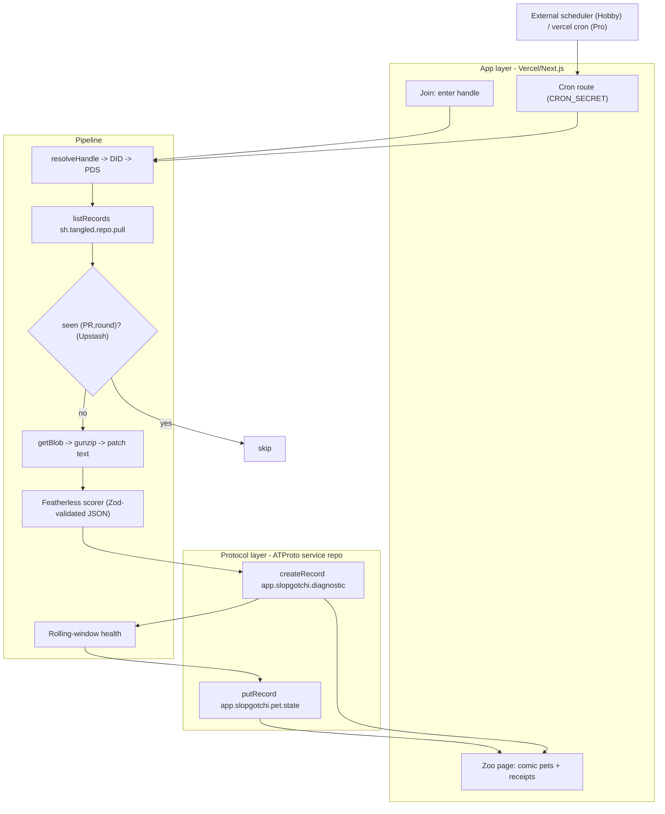

# feat: Slopgotchi — public AI-slop accountability pet for Tangled

## Summary

Build a Next.js (App Router) app on Vercel that lets a developer join a team "zoo," scores the AI slop in their Tangled pull requests with an open model on Featherless, writes the score and a receipt as public ATProto records, and renders a tamagotchi-style pet whose health is a rolling slop average. The implementation is layered: a read layer (handle→DID→PDS, `listRecords`, `getBlob`+gunzip), a scorer (Featherless via the OpenAI SDK with prompt-enforced JSON), a write layer (app-password service account writing `app.slopgotchi.*` records), a derived health model, a cron-driven scoring pipeline keyed for idempotency in Upstash Redis, and the comic-style zoo UI.

---

## Problem Frame

AI-generated contributions flood codebases with plausible-but-unconsidered output, and the cost lands diffusely on reviewers. Existing tools keep quality signals private and app-local. On Tangled, contribution activity is already public protocol data tied to identity, so an accountability signal can itself be public, portable, and identity-level (see origin: `docs/brainstorms/2026-06-24-slopgotchi-requirements.md`). This plan implements the V1 defined there: the protocol layer carries the truth (scores/receipts as ATProto records), the app layer carries the experience (the zoo) and a deferred monetization story.

---

## Key Technical Decisions

- KTD1. **App-password service account for writes; unauthenticated reads.** The service holds one ATProto account and writes `app.slopgotchi.*` records to its own repo via `@atproto/api` `AtpAgent.login` with an app password held only in a Vercel env var (never persisted to Redis). V1 logs in per invocation — write volume is low and the SDK keeps the session in memory for the call; cross-invocation session persistence/refresh is deferred. All reads of developer data (`resolveHandle`, `listRecords`, `getBlob`) are public and run against the developer's DID-resolved PDS with an unauthenticated agent. OAuth is deferred — it adds a confidential-client bootstrap with no benefit for a self-owned scheduled writer (see origin Key Decision: service-hosted labeler pattern).

- KTD2. **No formal lexicons in V1.** The PDS uses optimistic validation and stores records with unknown NSIDs as long as they are well-formed atproto data and `$type` equals the collection. We write `app.slopgotchi.diagnostic` and `app.slopgotchi.pet.state` directly. Formal lexicon JSON + `@atproto/lex-cli` codegen is deferred until the data model settles.

- KTD3. **`createRecord` for diagnostics, `putRecord` for pet state.** Diagnostics are append-only history → `createRecord` (TID rkey). Pet state is one-record-per-subject, updated over time → `putRecord` with a deterministic rkey derived from the subject DID. This makes pet state a single addressable record any client can fetch.

- KTD4. **Diff comes from the inline `patchBlob`, never from git.** Each `sh.tangled.repo.pull` round carries the patch as a gzipped git-format-patch blob. The read layer resolves the blob via `getBlob({did, cid})` and gunzips it (`node:zlib`). No knot/SSH/clone path exists in the pipeline (see origin Key Decision: the diff is on-protocol).

- KTD5. **Reliable JSON via prompt + validate + retry, not `response_format`.** Featherless does not document `response_format`/JSON-schema support, so the scorer inlines the schema in the system prompt, sets `temperature: 0` and a fixed `seed`, parses the first balanced JSON object, validates with Zod, and retries once with the parser error fed back. `response_format: {type: "json_object"}` is included unconditionally in the request (silently ignored if unsupported); the prompt + Zod + retry path is the only one relied on.

- KTD6. **The band is the load-bearing public signal; the raw score is a cached sample.** Serverless inference is not bitwise-deterministic even at temp 0, so the published diagnostic treats the health **band** (sharp / mild / sick) as the stable, defensible value and the raw 0–100 integer as a non-reproducible sample cached by `(PR, round)` (re-renders never re-roll). The record carries provenance (`model`, `seed`, `rulesetVersion`) so a third party understands why an independent re-score may differ. Only the health projection over already-frozen diagnostics is independently recomputable, not the raw integer.

- KTD7. **Large diffs handled by pre-filter + hard truncation (~16K tokens) for V1.** Drop lockfiles, generated, and vendored files, then truncate to the context budget using a char-count heuristic (~4 chars/token), preserving file paths and `@@` headers and marking truncated regions. The optional `/v1/tokenize` call refines the estimate but falls back to the heuristic if absent. Per-file map-reduce aggregation is deferred to follow-up.

- KTD8. **Upstash Redis is the single datastore.** It holds the idempotency set of processed `(PR, round)` keys, the connected-accounts/teams registry, and cached pet state. REST-based, fits stateless functions, one `vercel install upstash` to provision (see origin Dependencies: persistent store needed because serverless keeps no memory).

- KTD9. **Watching is cron-polling, with an external scheduler on Hobby.** A secured route handler (`CRON_SECRET`) runs the pipeline. Vercel Hobby crons fire only once per day, so per-minute "keeps watching" uses an external scheduler (cron-job.org / QStash) pinging the route; on Pro, native `vercel.json` crons replace it with no code change. Work is batched across invocations against the 300s cap (see origin Key Decision: cron poll, not websocket).

- KTD10. **Join via lightweight handle entry (accepted V1 trade-off).** A developer joins by entering their handle, which is resolved and registered; no ownership proof is required in V1, keeping the auth surface minimal for the hackathon. The known trade-off — handle entry is not proof of control, so the build technically allows registering a handle one does not own — is explicitly accepted for V1. ATProto OAuth ownership proof is deferred follow-up (see Scope Boundaries).

---

## High-Level Technical Design

The system is three layers from the origin: protocol (truth), pipeline (compute), app (experience). The pipeline is the spine — triggered by join (backfill) and by cron (ongoing), it is the same idempotent loop.



**Health computation (directional, not implementation spec).** Over the most recent `N = 10` diagnostics for a subject, newest first, with exponential decay `d ≈ 0.8`:

```text
weights      w_i = d^i           for i = 0 (newest) .. N-1
weightedSlop = Σ(w_i · slop_i) / Σ(w_i)
health       = clamp(0, 100, round(100 − weightedSlop))
band         = sharp | mild | sick   (from health thresholds)
```

Health is a pure projection of the diagnostic records — recomputable by any client from the same public data. A member with zero diagnostics is a distinct **"no diagnoses yet"** state (not one of the three bands): `health = 100`, rendered as a healthy pet labelled accordingly.

---

## Output Structure

```text
app/
  page.tsx                       # landing / join entry
  zoo/[team]/page.tsx            # team zoo (pets per member)
  zoo/[team]/loading.tsx         # skeleton fallback for the zoo fetch
  pet/[handle]/page.tsx          # single-pet receipt view
  api/
    join/route.ts                # register a handle into a team (rate-limited)
    status/[handle]/route.ts     # join/backfill progress for the landing poll
    cron/poll/route.ts           # secured polling entry (timing-safe CRON_SECRET)
lib/
  atproto/
    resolve.ts                   # handle->DID->PDS resolution
    read.ts                      # listRecords + getBlob + gunzip
    write.ts                     # service session, createRecord/putRecord
  scorer/
    featherless.ts               # OpenAI-SDK client + request
    prompt.ts                    # rubric system prompt + schema
    parse.ts                     # extract + Zod-validate + retry
    diff.ts                      # pre-filter + truncate to budget
  health.ts                      # rolling-window projection + bands
  pipeline.ts                    # join/cron orchestration, idempotency
  store.ts                       # Upstash Redis accessors
  types.ts                       # shared record + score types (Zod)
components/
  Pet.tsx  Zoo.tsx  Receipt.tsx  # comic-style rendering
vercel.json                      # crons (Pro) + function maxDuration
```

The per-unit `**Files:**` lists are authoritative; this tree is the scope declaration.

---

## Requirements

Carried from origin and grouped by concern; origin R-IDs preserved for traceability.

**Identity & onboarding**

- R1. A developer joins a team's zoo themselves; receipts are only written about developers who have joined (origin R1). V1 uses lightweight handle entry (see KTD10).
- R2. Joining resolves the handle to a DID; no write access to the developer's repo is required (origin R2).
- R3. On join, the system backfills by enumerating the developer's `sh.tangled.repo.pull` records and scoring each (origin R3).

**Slop analysis pipeline**

- R4. For each PR round, the inline `patchBlob` is resolved, gunzipped to git-format-patch text, and scored on Featherless against the rubric (origin R4).
- R5. The model returns structured data: 0–100 slop score, per-category sub-scores, verdict band, reasons, suggested medicine, confidence (origin R5).
- R6. A cron-polled route scores newly committed pull records and new rounds for connected identities; backfill and watch are one loop (origin R6, KTD9).
- R7. Each diagnostic is idempotent on `(pull AT-URI, round)`; a round seen across multiple polls yields exactly one diagnostic (origin R7).

**Protocol records (truth layer)**

- R8. Each analyzed round writes a public `app.slopgotchi.diagnostic` record referencing the PR and the developer DID (origin R8).
- R9. Each developer has a public `app.slopgotchi.pet.state` record carrying health, condition, latest-diagnostic pointer, and timestamp — recomputable from diagnostics (origin R9).
- R10. Records are world-readable and self-describing enough that a third-party client can render a pet and its receipts without the app (origin R10).

**Health model**

- R11. Health = `100 − weighted average slop` over the most recent N PRs (default N=10, recency-weighted exponential decay), clamped 0–100 (origin R11).
- R12. A developer with no analyzed PRs has health 100 and a "no diagnoses yet" state (origin R12).
- R13. Health updates whenever a new diagnostic lands, including re-scores from new rounds, so clean revisions visibly restore health (origin R13).

**Zoo experience (app layer)**

- R14. Each team has a zoo page rendering one pet per member with the owner's handle shown above each pet, in a 2D comic style (origin R14).
- R15. A pet's appearance/mood reflects its health band (origin R15).
- R16. Selecting a pet opens its accountability view: health, recent PRs with scores, and the latest sickness reasons + medicine (origin R16).

---

## Implementation Units

### Phase A — Foundation

### U1. Project scaffold and Vercel/Upstash deploy skeleton

- Goal: A deployable Next.js App Router app with Upstash wired, env scaffolding, and a "hello zoo" page live on Vercel.
- Requirements: enables R14 (shell).
- Dependencies: none.
- Files: `app/page.tsx`, `app/layout.tsx`, `lib/store.ts`, `vercel.json`, `package.json`, `.env.example`, `README.md`.
- Approach: `create-next-app` (TypeScript, App Router). `vercel install upstash` to provision Redis and inject `UPSTASH_REDIS_REST_URL/TOKEN`. Add `lib/store.ts` thin wrapper over `@upstash/redis`. Define env contract: `FEATHERLESS_API_KEY`, `SLOPGOTCHI_PDS`, `SLOPGOTCHI_IDENTIFIER`, `SLOPGOTCHI_APP_PASSWORD`, `CRON_SECRET`. `vercel.json` declares `functions[...].maxDuration` and (on Pro) a `crons` entry.
- Patterns to follow: standard Next.js App Router conventions; Upstash REST client idioms.
- Test scenarios:
  - Test expectation: none — scaffolding and config; verified by a successful production deploy and a reachable landing page.
- Verification: app deploys to Vercel; landing page renders; a trivial Redis set/get round-trips via `lib/store.ts`.

### U2. ATProto read layer (handle → DID → PDS, listRecords, getBlob, gunzip)

- Goal: Given a handle, enumerate its `sh.tangled.repo.pull` records and return decoded patch text per round.
- Requirements: R2, R3, R4, R10.
- Dependencies: U1.
- Files: `lib/atproto/resolve.ts`, `lib/atproto/read.ts`, `lib/types.ts`, `lib/atproto/read.test.ts`.
- Approach: `resolve.ts` calls `com.atproto.identity.resolveHandle`, then resolves the DID document (`@atproto/identity` `IdResolver`/`getPds`, with `plc.directory` for `did:plc`) to the PDS endpoint; cache DID + PDS by handle. `read.ts` builds an unauthenticated `AtpAgent({service: pds})`, paginates `listRecords({repo: did, collection: 'sh.tangled.repo.pull', limit: 100, cursor})`, and for each record's `rounds[]` resolves `patchBlob.ref` via `getBlob({did, cid})`, gunzips bytes (`node:zlib`), and yields `{prUri, roundIndex, patchText, target, source, title}`.
- Execution note: Start with a failing integration test that resolves a real public Tangled handle and decodes one round's patch — this is the load-bearing spike from the brainstorm.
- Patterns to follow: `@atproto/api` `listRecords`/`getBlob` shapes; `BlobRef.ref.toString()` for the CID.
- Test scenarios:
  - Covers AE1. Handle with zero pull records → empty enumeration, no error.
  - Resolve a known handle → expected DID; cache returns same DID without re-fetch.
  - A record with one round → patch text decoded; `target.repo`/`source.branch` parsed.
  - A record with multiple rounds → each round enumerated with correct `roundIndex`.
  - Pagination: a repo with >100 pulls → cursor loop returns all records.
  - getBlob on a gzipped blob → gunzip yields valid git-format-patch text (starts with `From ` / `diff --git`).
  - Unresolvable handle or missing PDS service entry → typed error, not a throw that crashes the pipeline.
- Verification: an integration test against a real public Tangled handle returns decoded patches for its PRs.

### U3. Featherless slop scorer (prompt, validate, retry, large-diff handling)

- Goal: Turn patch text into a validated structured slop score deterministically enough to publish.
- Requirements: R4, R5.
- Dependencies: U1.
- Files: `lib/scorer/featherless.ts`, `lib/scorer/prompt.ts`, `lib/scorer/parse.ts`, `lib/scorer/diff.ts`, `lib/types.ts`, `lib/scorer/parse.test.ts`, `lib/scorer/diff.test.ts`.
- Approach: `featherless.ts` uses the `openai` SDK with `baseURL: https://api.featherless.ai/v1` and `FEATHERLESS_API_KEY`; model `Qwen/Qwen2.5-Coder-32B-Instruct` (confirm via `/v1/models`); `temperature: 0`, fixed `seed`, `top_p: 1`, `response_format: {type: 'json_object'}` (ignored if unsupported). `prompt.ts` holds the rubric system prompt (scope discipline 25 / specificity 20 / dependency restraint 20 / test thoughtfulness 20 / maintainability 15) with the JSON schema inlined and the "AI slop, not AI authorship" framing (origin Scope Boundaries). `parse.ts` strips fences, extracts the first balanced object, `JSON.parse`, Zod-validates, and retries once feeding back the parser error. `diff.ts` pre-filters generated/lockfile/vendored paths and truncates to the context budget via a char-count heuristic (`/v1/tokenize` as an optional refinement, falling back to the heuristic if absent), preserving file paths and `@@` headers and marking truncated regions. Per-file map-reduce is deferred.
- Patterns to follow: OpenAI SDK `baseURL` override; Zod schema as the single source of truth for the score type.
- Test scenarios:
  - Happy path: a clean small patch → low slop score, verdict "clean", valid object.
  - A sloppy patch (broad refactor, no tests, new dep) → high score with reasons populated.
  - Malformed model output (markdown-fenced JSON) → parser strips fences and succeeds.
  - Invalid JSON on first attempt → retry path triggers; second valid response accepted.
  - Retry also fails → typed scorer error surfaced (caller can skip without crashing the batch).
  - Schema violation (score out of 0–100, missing field) → Zod rejects; retry fires.
  - Large diff over context budget → `diff.ts` truncates to budget preserving file paths/`@@` headers and a truncation marker; a single score is returned.
  - Pre-filter drops `package-lock.json`/generated files before measuring length.
  - Determinism: same patch scored twice at temp 0 maps to the same band (assert band equality, not exact integer).
- Verification: scoring a fixture clean patch and a fixture sloppy patch yields bands on opposite ends with populated reasons.

### U4. ATProto write layer (service session, diagnostic + pet-state records)

- Goal: Persist a validated score as a public diagnostic record and update the subject's pet-state record.
- Requirements: R8, R9, R10.
- Dependencies: U1.
- Files: `lib/atproto/write.ts`, `lib/types.ts`, `lib/atproto/write.test.ts`.
- Approach: `write.ts` logs in via `AtpAgent.login` (app password from env) per invocation — no session is persisted to Redis. `writeDiagnostic(score)` calls `createRecord({repo: serviceDid, collection: 'app.slopgotchi.diagnostic', record})` with `$type` equal to the collection, `subject` DID, `prUri`, `round`, the band, the raw score (marked as a sample), category scores, reasons, medicine, `model`, `seed`, `rulesetVersion`, `createdAt`. To stay idempotent under retries, the diagnostic uses a deterministic rkey derived from `(prUri, round)` (or a pre-write `listRecords` probe) so a retry after an unacknowledged write cannot duplicate. `putPetState(subjectDid, state)` calls `putRecord` with `rkey` = sanitized subject DID, overwriting the single pet-state record. Record shapes validated by the shared Zod types before write.
- Patterns to follow: `putRecord` create-or-replace idiom; deterministic-rkey idempotency; rkey charset rules.
- Test scenarios:
  - createDiagnostic writes a record whose `$type` matches the collection and round-trips via `listRecords`.
  - Re-writing the same `(prUri, round)` diagnostic does not create a duplicate (deterministic rkey).
  - putPetState twice for the same subject → one record, second call overwrites (rkey stable).
  - rkey sanitization: a subject DID maps to a valid rkey (allowed charset, ≤512, not `.`/`..`).
  - Login uses the app password from env only; no session token is written to Redis.
  - Malformed record (fails Zod) is rejected before the network call.
  - A write 429 surfaces a typed rate-limit error the pipeline can back off on.
- Verification: after a write, the diagnostic and pet-state records are readable back from the service repo via an unauthenticated agent.

### Phase B — Domain logic

### U5. Health model (rolling-window projection + bands)

- Goal: Compute health and band from a subject's diagnostics as a pure projection.
- Requirements: R11, R12, R13.
- Dependencies: none (diagnostics are supplied in-memory by the pipeline; no read-back required).
- Files: `lib/health.ts`, `lib/health.test.ts`.
- Approach: `computeHealth(diagnostics)` takes the most recent N=10 by `createdAt`, applies exponential decay weights (`d≈0.8`), returns `{health, band, latestDiagnosticUri}`. Pure function, no I/O; callers pass the in-memory diagnostic set (already-stored + just-scored) so health never depends on a read-after-write. Band thresholds (sharp / mild / sick) defined as constants. Zero diagnostics → `{health:100, band:null, state:'no-diagnoses'}` — distinct from the three bands.
- Patterns to follow: pure-function + table-of-thresholds; deterministic given inputs.
- Test scenarios:
  - No diagnostics → health 100, `no-diagnoses` state (not a band).
  - Covers AE2. A high-slop history followed by clean PRs → health climbs as old PRs age out / decay.
  - Recency weighting: a recent sloppy PR moves health more than an equally-sloppy old one.
  - Window cap: only the most recent N count; the (N+1)th oldest has no effect.
  - Band boundaries: health at each sharp/mild/sick threshold maps to the expected band (edge values tested).
  - Clamp: pathological inputs never produce health <0 or >100.
- Verification: unit tests cover empty, single, full-window, and over-window histories with expected health/band.

### U6. Scoring pipeline + idempotency orchestration

- Goal: For a given DID, score all unseen `(PR, round)` pairs end-to-end and update protocol records exactly once each.
- Requirements: R6, R7, R13.
- Dependencies: U2, U3, U4, U5.
- Files: `lib/pipeline.ts`, `lib/store.ts`, `lib/pipeline.test.ts`.
- Approach: `processSubject(did)` enumerates rounds (U2), and for each atomically claims the round with `SETNX diag:{prUri}:{round}` — this is the single check-and-set; there is no separate "mark seen" step. On a successful claim it fetches the patch → scores (U3) → writes the diagnostic (U4, idempotent on `(prUri, round)`) → recomputes health (U5) from the in-memory diagnostic set (already-stored + just-scored) → `putPetState` (U4). If any step throws, the catch block `DEL`s the claim key so the round is retried on the next poll (never silently dropped). A round already claimed-and-completed is skipped. One failing round does not abort the batch.
- Patterns to follow: `SETNX` atomic claim + delete-on-failure for safe retries; idempotent diagnostic write; per-item try/catch so one failure doesn't sink the batch.
- Test scenarios:
  - Covers AE4. A round processed during backfill, then seen again on a later poll → no second diagnostic (claim guards).
  - Covers AE3. A new round on an already-scored PR → new diagnostic written, health recomputed, prior round not duplicated.
  - A failure after claiming a round (scorer/write throws) → the claim key is `DEL`d and the round is re-scored on the next poll, not silently dropped.
  - Two overlapping invocations seeing the same unclaimed round → only one claims it; the diagnostic is not duplicated.
  - First run on a fresh DID → all rounds scored, pet state created.
  - Claim key format isolates PR + round (two rounds of one PR are distinct keys).
  - After processing, pet-state health equals `computeHealth` over the in-memory diagnostic set.
- Verification: running `processSubject` twice over the same data produces the same record set the second run as the first (no duplicates, no drift); a simulated mid-round failure leaves the round retryable, not lost.

### Phase C — Product surface

### U7. Join + backfill flow

- Goal: A developer joins a team by handle; the system registers them and backfills their pets.
- Requirements: R1, R2, R3.
- Dependencies: U6.
- Files: `app/api/join/route.ts`, `app/api/status/[handle]/route.ts`, `app/page.tsx`, `lib/store.ts`, `app/api/join/route.test.ts`.
- Approach: POST handle (+ team) → resolve to DID (U2) → register `{team, did, handle}` in Redis (the registry also stores the handle→DID mapping for the receipt page). The endpoint is rate-limited per IP (Redis counter + TTL). It kicks off a **bounded** backfill of the most recent `MAX_BACKFILL_ROUNDS` rounds via `waitUntil`; any remainder is finished by the normal cron loop (U8) across later invocations, so backfill is never trapped by the 300s cap. `app/page.tsx` renders the join form (handle + team; team is a free-form slug → `/zoo/[team]`); after submit it polls `app/api/status/[handle]` every ~3s, advancing **Joining → Backfilling → Done** (redirect to the zoo), and renders the API's error message inline on a 400. `app/zoo/[team]/page.tsx` also offers a "Join this zoo" affordance pre-filled with the slug. V1 trusts handle entry (KTD10, accepted).
- Execution note: Implement the join contract test-first (request shape → registered account + bounded backfill kickoff).
- Patterns to follow: App Router route handler; per-IP Redis rate limit; `waitUntil` for fire-and-forget backfill; cron loop as the continuation mechanism.
- Test scenarios:
  - Valid handle → DID resolved, account registered, bounded backfill kicked off, 200 returned before backfill completes.
  - Unresolvable handle → 400 with a clear message rendered inline; nothing registered.
  - Duplicate join (same handle+team) → idempotent; no duplicate registration, no double backfill storm.
  - Per-IP rate limit: rapid repeat joins from one IP are throttled (429) past the cap.
  - Backfill beyond `MAX_BACKFILL_ROUNDS` is left for the cron loop; no single request enqueues unbounded scoring.
  - Status endpoint returns Joining / Backfilling / Done from registration + pet-state presence.
  - Registered account (with handle→DID mapping) appears in the team's connected-accounts list.
- Verification: joining a real handle registers it and produces pet state within the backfill window; a high-PR handle populates progressively across cron polls without exceeding the function budget.

### U8. Cron poll endpoint

- Goal: A secured scheduled route that re-scores connected identities on an interval.
- Requirements: R6, R7.
- Dependencies: U6, U7.
- Files: `app/api/cron/poll/route.ts`, `vercel.json`, `app/api/cron/poll/route.test.ts`.
- Approach: GET guarded by a **timing-safe** compare (`crypto.timingSafeEqual`) of the `Authorization: Bearer ${CRON_SECRET}` header. Iterate connected DIDs and run `processSubject` per DID within `maxDuration`, honoring a hard cap on DIDs processed per invocation (`waitUntil` for tail work); cursor-based continuation across invocations is deferred. `vercel.json` declares a Pro cron; for Hobby, document an external scheduler (cron-job.org/QStash) hitting the route every ~60s. Idempotency (U6) makes repeated/overlapping invocations safe.
- Patterns to follow: timing-safe `CRON_SECRET` bearer check; per-invocation DID cap with `waitUntil` tail.
- Test scenarios:
  - Missing/incorrect bearer token → 401, no work performed.
  - Token comparison is constant-time (timing-safe).
  - Valid token, no connected accounts → 200, no-op.
  - Valid token with connected accounts → each is processed via the pipeline.
  - A new round appearing since last poll → scored on this invocation; an unchanged account → no new diagnostics (idempotent).
  - More accounts than the per-invocation cap → the cap is honored and the rest are picked up on the next poll.
- Verification: hitting the route with the secret scores any new rounds; without the secret it is rejected.

### U9. Zoo UI (team zoo, pet rendering, receipt view)

- Goal: Render the comic-style zoo and per-pet accountability receipts from the public records.
- Requirements: R14, R15, R16, R10.
- Dependencies: U4 (records to read), U5 (band logic).
- Files: `app/zoo/[team]/page.tsx`, `app/zoo/[team]/loading.tsx`, `app/pet/[handle]/page.tsx`, `components/Zoo.tsx`, `components/Pet.tsx`, `components/Receipt.tsx`, `components/Pet.test.tsx`.
- Approach: The zoo page reads connected accounts for the team and their pet-state records, rendering one `Pet` per member (handle label above) in a 2D comic style. `Pet` branches three ways: **pending** (registered, no pet-state record yet → greyed silhouette, "Backfilling…"), **no-diagnoses** (health 100, no band → healthy sprite, "No PRs scored yet"), and **active** (a band). The band→sprite/mood map is a constant table keyed to the three bands and shared with `lib/health.ts` so keys can't drift: `sharp → healthy`, `mild → queasy`, `sick → ailing` (asset names TBD by design). An empty team renders an empty-zoo state (team name + "Be the first — join"); the record fetch is wrapped in a `Suspense` boundary with a skeleton fallback (`loading.tsx`). The pet page is routed by `[handle]`; it resolves handle→DID via the registry mapping (cached) to read the DID-keyed pet-state and recent diagnostics, and renders the receipt: health, PR history with per-PR slop score and a **delta** (current round's score minus the previous round of the same PR; omitted when a PR has only one round), and the latest reasons + medicine. Zero-diagnoses renders a "No PRs scored yet" message in place of the table. Pet cards are `<a href="/pet/[handle]">` links so keyboard/focus is browser-native. Rendering is from the public records so the view is reproducible by any client.
- Patterns to follow: server components reading records; shared band→sprite mapping table; `Suspense` + `loading.tsx` skeleton.
- Test scenarios:
  - A team with members at different bands → each pet renders the correct sharp/mild/sick sprite.
  - A member registered but not yet backfilled → pending pet (greyed, "Backfilling…").
  - A member with no diagnoses → "No PRs scored yet" state, healthy sprite, health 100.
  - An empty team → empty-zoo state, not a crash.
  - Receipt view lists recent PRs with scores and per-PR deltas (delta omitted for single-round PRs) and shows latest reasons + medicine.
  - Receipt for a handle with zero diagnostics → "No PRs scored yet" in place of the table; reasons/medicine hidden.
  - Covers AE2/AE3 (visual): after a clean round, the receipt reflects improved health.
- Verification: the zoo renders real pets from real records (including pending and empty states), and clicking a pet shows its receipt.

---

## Acceptance Examples

Carried from origin; enforced by the linked unit tests above.

- AE1. New member, no PRs → pet at health 100, "no diagnoses yet" (U2, U5, U9).
- AE2. Clean streak recovers health as old high-slop PRs age out of the window (U5, U9).
- AE3. A new round re-scores: new diagnostic written, health recomputed, prior round not duplicated (U6).
- AE4. Backfill/live dedupe: a round seen by both backfill and a later poll yields one diagnostic (U6, U8).

---

## Scope Boundaries

**Deferred for later** (origin)

- Skins, looks, backgrounds, and the payments behind them — business-model pitch only.
- Native desktop tamagotchi client.
- Auto-discovery / analysis of identities not added to a zoo.
- Repo-level pets and teammate interactions.
- Weighting by PR status (open / closed / merged).
- A Spindle/CI "slop check" surface as an alternative per-repo trigger.
- Fetching repo style context (raw files / archive) as extra model input.

**Outside this product's identity** (origin)

- Detecting whether AI was used — Slopgotchi scores carelessness/overbuild/weak-tests/bloat, not authorship.
- Becoming a general-purpose AI code reviewer or merge gate — the output is an accountability signal, not a blocking verdict.
- Private, app-local scores — if the score isn't a public protocol record, the differentiator is gone.

**Deferred to Follow-Up Work** (plan-local)

- Formal `app.slopgotchi.*` lexicon JSON + `@atproto/lex-cli` codegen (KTD2) once the data model settles.
- ATProto OAuth sign-in for join ownership proof (KTD10) — the accepted V1 trade-off is unproven handle entry.
- True real-time Jetstream listener (an always-on worker off Vercel) replacing cron polling.
- Migration to native Vercel Pro crons from the external scheduler.
- Per-file map-reduce aggregation for diffs exceeding the model context (V1 pre-filters + truncates).
- ATProto session persistence/refresh across invocations (V1 logs in per invocation).
- Cursor-based cron continuation for large connected-account sets (V1 uses a per-invocation DID cap).

---

## Risks & Dependencies

- **Featherless plan gating / model availability.** `Qwen2.5-Coder-32B` needs the Premium ($25) tier and ~16K context; model IDs shift. Mitigation: confirm via `/v1/models` at build time; fall back to a smaller model on a cheaper tier (KTD5/KTD7). `/v1/tokenize` availability is unconfirmed — diff sizing falls back to a char-count heuristic.
- **Public-endpoint abuse.** The unauthenticated `/api/join` can trigger paid scoring work. Mitigation: per-IP rate limit + `MAX_BACKFILL_ROUNDS` cap (U7); the cron secret is compared timing-safe (U8).
- **JSON reliability.** `response_format` is unconfirmed on Featherless. Mitigation: prompt + Zod + one retry is the backbone (KTD5).
- **Tangled PDS specifics.** Blob size cap and whether a public AppView exists for reads are unverified; per-PDS resolution is the fallback. Confirm early (this is the U2 spike).
- **Vercel Hobby cron limits.** Per-minute needs Pro or an external scheduler (KTD9). Mitigation: external pinger for the demo; one-line switch to native cron on Pro.
- **ATProto write rate limits.** Points-based (~1,666 creates/hr). Mitigation: batch, respect 429s, idempotency avoids redundant writes (U6).
- **Score nondeterminism / recomputability.** Not bitwise-stable even at temp 0, so the published raw integer is a sample, not independently reproducible. Mitigation: the **band** (sharp/mild/sick) is the load-bearing public value, cached by `(PR, round)`, with model/seed/ruleset provenance on the record (KTD6).
- **Dependencies:** `@atproto/api` (pin the 0.x version), `@atproto/identity`, `openai`, `@upstash/redis`, `zod`, Next.js; service ATProto account + app password; Featherless API key; Upstash instance; external scheduler (Hobby).

---

## Open Questions

Deferred to implementation:

- Exact band thresholds (sharp / mild / sick) and the decay constant `d` / window `N` — tune against real scored PRs.
- `MAX_BACKFILL_ROUNDS` and the per-invocation DID cap — tune to the 300s budget.
- Team model is a free-form string namespace for V1; richer membership semantics are deferred.
- Whether to read records via a Tangled public AppView (if one exists) instead of per-PDS resolution, for simpler reads.

---

## Sources / Research

- ATProto SDK: `@atproto/api` v0.20.16 — `AtpAgent.login` (app password, per-invocation), `com.atproto.identity.resolveHandle`, DID-doc → PDS via `@atproto/identity`, `listRecords` (public, cursor-paginated), `getBlob({did, cid})`, `createRecord` (TID) vs `putRecord` (deterministic rkey), optimistic lexicon validation. Bluesky rate limits (points-based).
- Featherless: OpenAI-compatible `https://api.featherless.ai/v1`; `Qwen/Qwen2.5-Coder-32B-Instruct` (~16K, Premium); `response_format` not documented → prompt + validate + retry; `temperature`/`seed` supported but no bitwise determinism; pre-filter + truncate for large diffs (map-reduce deferred); `/v1/tokenize` for sizing with char-count fallback.
- Vercel: Hobby crons once/day (per-minute needs Pro or external scheduler); functions 300s (Hobby) / 800s (Pro), `waitUntil` + batching; Vercel Postgres/KV retired → Marketplace (Upstash Redis recommended single store).
- Tangled lexicons: `sh.tangled.repo.pull` with inline `rounds[].patchBlob` (gzipped git-format-patch), `target{repo:DID, branch}`, `source{branch, repo?}`; public repos readable unauthenticated. Verified in origin: `docs/brainstorms/2026-06-24-slopgotchi-requirements.md`.
